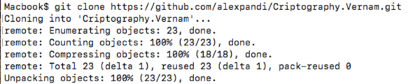
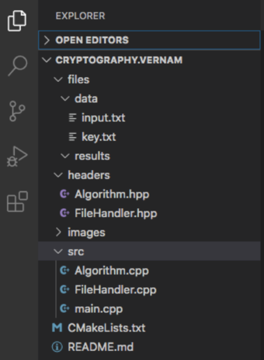
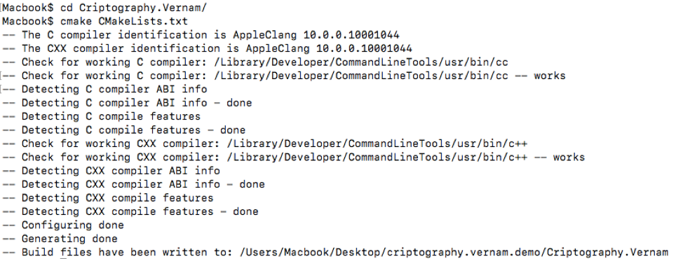
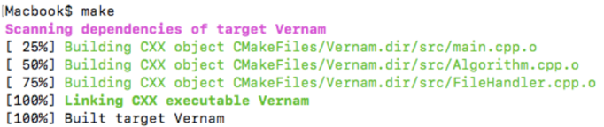
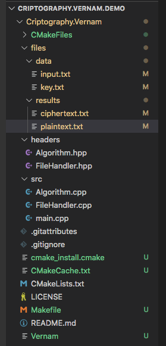
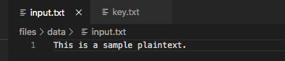
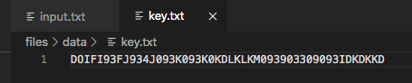
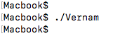
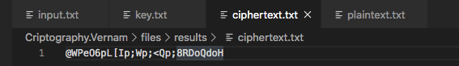
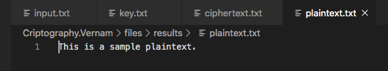

# Vernam Criptography  Project

### Prerequisites:
 * CMake 3.15.0
 * GCC C++1z
 
#### NOTE: This project runs on UNIX CLI.

### Usage steps:
 #### 1. Clone the repository
   

    Your directory structure should look like this:

   
 #### 2. Run: cmake CMakeLists.txt
   
 #### 3. Run: make
   

    CMake and Make actions should generate the executable file as well as a bunch of auxiliary files:

   
 #### 4. Fill in the plaintext: files/data/input.txt
   
 #### 5. Fill in the key: files/data/key.txt
   
 #### 6. Run: ./Vernam
   
 #### 7. Check file for ciphertext: files/results/ciphertext.txt
   
 #### 8. Check file for plaintext: files/results/plaintext.txt
   

### Tips:
 1. Restart at step 4 to repeat the experiment.**
 2. Restart at step 3, if you modify the source code with C++11 compatible functionalities.**
 3. If you update the source code using C++1z or C++2x, restart at step 2, after modifying the CXX flags.**

### Notes:
 1. You don't need to cleanup the results directory as the script replaces the files automatically.
 2. This is a sample adaptation for academic purposes only.

#### Copyright Alex Pandi @ 2020
